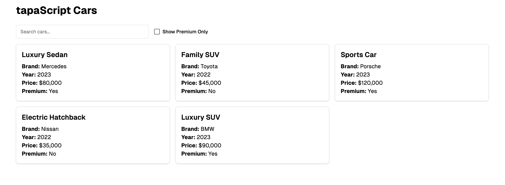

Complete this task to show that you can now think in react.

## Tasks
- Study this user interface design very well.
  > 
- Break this design into the logical structure of components as you have learned in the video lesson.
- Create a Component Hierarchy Diagram using excalidraw or any other tool of your choice.
- Create the Components and compose them to align with the above hierarchy. Here is the JSON data to use:
  ```js
  [   
    { id: 1, title: "Luxury Sedan", brand: "Mercedes", year: 2023, price: 80000, isPremium: true },
    { id: 2, title: "Family SUV", brand: "Toyota", year: 2022, price: 45000, isPremium: false },
    { id: 3, title: "Sports Car", brand: "Porsche", year: 2023, price: 120000, isPremium: true },
    { id: 4, title: "Electric Hatchback", brand: "Nissan", year: 2022, price: 35000, isPremium: false },
    { id: 5, title: "Luxury SUV", brand: "BMW", year: 2023, price: 90000, isPremium: true },
  ]
  ```
- Match the component hierarchy in the React Dev Tool
- Now use TailwindCSS to style the components to match the user interface design.
- Make sure your code is well-formatted.
- Make sure there is NO Eslint error or Eslint supression.
- Make sure there are no console errors.
- Push the project into GitHub.
- Deploy the project on Netlify/Vercel/Render.
- Write a good `Readme.md` file: 
  - Explaining your project
  - How to run it
  - The screenshot of the UX design diagram
  - Component Breakdown diagram
  - Component Hierarchy diagram
  - React Dev Tools Screenshot
  - The Readme should have the deploy link of the app too.

## Share the folowings in the task channel of Discord
Just Your project repository link with the `readme` explained above. 