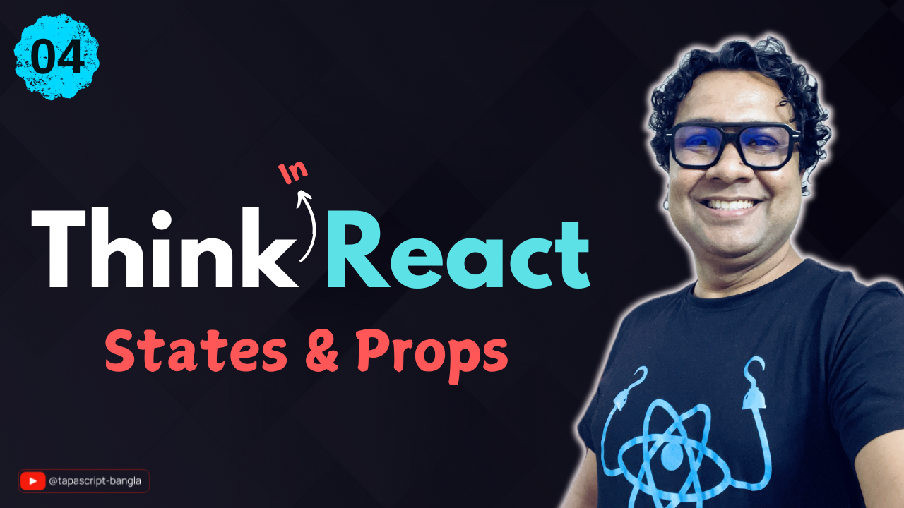

# 04 - Identifying States and Props

Identify the state and props with proper logic and formula.

## 🫶 Support
Liked it? It takes months of hard work to create quality content and present to you. You can show your support to me with a STAR(⭐) to this repository.

> Many Thanks to all the `Stargazers` who have supported this project with stars(⭐)

### 🤝 Sponsor My Work
I am an independent educator and open-source enthusiast who creates meaningful projects to teach programming on my YouTube Channel. **You can support my work by [Sponsoring me on GitHub](https://github.com/sponsors/atapas) or [Buy Me a Cofee](https://buymeacoffee.com/tapasadhikary)**.

## The Video Tutorial
In this video tutorial, we have developed a UI design with the "Thinking in React" mindset.

Here is the video for you to go through and learn:

## Tasks
Please complete these tasks. Refer to the video tutorial above to learn.

- [Tasks](./task.md)

